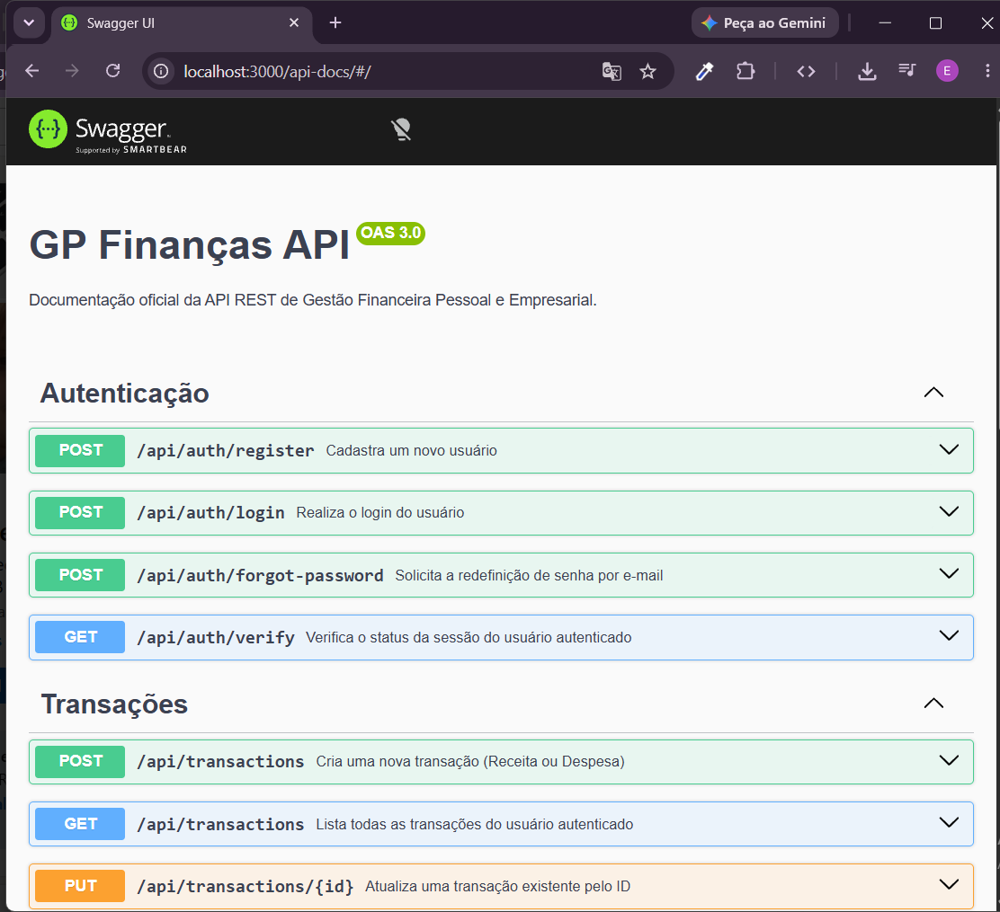
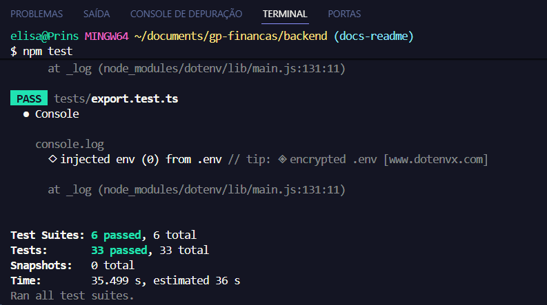

<div align="center">

# 💰 GP Finanças

**API REST para gestão financeira pessoal** — controle de receitas e despesas, orçamentos por categoria, dashboards analíticos e exportação de relatórios em PDF/CSV.

Construída para simular um produto real de fintech, com autenticação segura via JWT + cookies HTTP-only, rate limiting, documentação interativa via Swagger e arquitetura em camadas.


**✅ 33/33 testes automatizados passando** &nbsp;•&nbsp; **📖 Documentação interativa em `/api-docs`**

[Funcionalidades](#-funcionalidades) • [Segurança](#-segurança) • [Como Rodar](#️-como-rodar-localmente) • [Documentação da API](#-documentação-interativa-swagger) • [Testes](#-testes)

</div>

---

> 🚧 **Status:** back-end funcional, testado e documentado. Front-end (React) em desenvolvimento — em breve neste mesmo repositório/organização.

## 🎯 Sobre o Projeto

O GP Finanças resolve um problema real: organizar receitas, despesas e metas de orçamento de forma simples, com relatórios exportáveis para análise fora da plataforma. O projeto foi construído do zero para praticar decisões de arquitetura comuns em produtos financeiros reais, separação clara de camadas, autenticação segura, tratamento de erros centralizado, proteção contra abuso de requisições e documentação interativa da API.

## ✨ Funcionalidades

| Módulo | O que faz |
|---|---|
| 🔐 **Autenticação** | Registro, login (JWT em cookie `httpOnly`) e redefinição de senha por e-mail com token expirável |
| 💸 **Transações** | CRUD de receitas/despesas com categoria, forma de pagamento e perfil PF/PJ |
| 🏷️ **Categorias** | Categorias personalizadas por usuário + categorias padrão do sistema |
| 🎯 **Orçamentos** | Metas de gasto por categoria/mês, com cálculo automático de percentual utilizado |
| 📊 **Dashboard** | Resumo geral, totais por categoria, top 5 despesas e tendência mensal |
| 📁 **Exportações** | Relatórios em **CSV** (compatível com Excel) e **PDF** (extrato formatado com totais) |
| 📖 **Documentação** | Swagger/OpenAPI interativo disponível em `/api-docs`, com todas as 16 rotas mapeadas |

## 🔒 Segurança

- **JWT em cookie `httpOnly`**, com `secure` e `sameSite` ajustados por ambiente, ao invés de armazenar o token em `localStorage` (mitiga XSS)
- **Helmet** ativado globalmente, aplicando headers HTTP de segurança recomendados
- **Hash de senha com bcrypt** (nunca armazenada em texto plano)
- **Validação de senha forte** via regex: mínimo 8 caracteres, exigindo maiúscula, minúscula, número e caractere especial
- **Proteção contra user enumeration**: o endpoint de redefinição de senha sempre retorna a mesma mensagem genérica, independente do e-mail estar cadastrado ou não — evitando que alguém descubra quais e-mails existem na base
- **Rate limiting diferenciado**: limite mais restritivo nas rotas de autenticação (10 req/min) do que nas demais rotas da API (50 req/5min), reduzindo a superfície de ataques de força bruta
- **CORS restrito por ambiente**: em produção, aceita apenas a origin configurada em `FRONTEND_URL`; em desenvolvimento, libera as portas locais comuns

## 🛠️ Tecnologias Utilizadas

- **Node.js** + **Express** (TypeScript)
- **Prisma ORM** com **MongoDB**
- **JWT** + Cookies HTTP-only para autenticação
- **bcryptjs** para hash de senhas
- **Helmet** para headers de segurança HTTP
- **PDFKit** para geração de relatórios em PDF
- **Nodemailer** para envio de e-mails
- **express-rate-limit** para proteção contra abuso de requisições
- **Swagger (OpenAPI 3.0)** para documentação interativa da API
- **Jest** + **Supertest** para testes automatizados

## ⚙️ Como Rodar Localmente

**Pré-requisitos:** Node.js 18+, uma instância MongoDB ([Atlas](https://www.mongodb.com/atlas) funciona bem) e uma conta SMTP de testes (recomendado: [Mailtrap](https://mailtrap.io)).

```bash
# Clone o repositório
git clone https://github.com/seu-usuario/gp-financas.git
cd gp-financas

# Instale as dependências
npm install

# Configure as variáveis de ambiente
cp .env.example .env
# edite o .env com suas credenciais (veja tabela abaixo)

# Gere o Prisma Client
npx prisma generate

# Inicie o servidor em modo desenvolvimento
npm run dev
```

O servidor sobe em `http://localhost:3000`.

<details>
<summary><strong>📋 Variáveis de ambiente necessárias</strong></summary>

<br>

| Variável | Descrição |
|---|---|
| `DATABASE_URL` | String de conexão do MongoDB |
| `JWT_SECRET` | Chave secreta para assinatura dos tokens JWT |
| `PORT` | Porta do servidor (padrão: 3000) |
| `SMTP_HOST` / `SMTP_PORT` | Host e porta do provedor SMTP |
| `SMTP_USER` / `SMTP_PASS` | Credenciais do provedor SMTP |
| `EMAIL_FROM` | Remetente exibido nos e-mails enviados |
| `FRONTEND_URL` | URL usada para montar o link de redefinição de senha e liberada no CORS em produção |

Veja o formato completo em [`.env.example`](./.env.example).

</details>

## 📖 Documentação Interativa (Swagger)

Com o servidor rodando, a documentação completa da API está disponível em:

```
http://localhost:3000/api-docs
```

Todas as **16 rotas** da API estão mapeadas com parâmetros, exemplos de corpo de requisição e possíveis respostas, organizadas por módulo (Autenticação, Transações, Categorias, Orçamentos, Dashboard e Exportação). É possível testar as requisições diretamente pela interface do Swagger UI.

<p align="center">
    
</p>

## 🧪 Testes

```bash
npm test
```

**✅ 33/33 testes passando (100%)** — suíte automatizada com **Jest + Supertest** cobrindo:

- Fluxos de autenticação (registro, login, credenciais inválidas, e-mail duplicado)
- CRUD completo de transações, categorias e orçamentos
- Regras de negócio (orçamento duplicado → 409, exclusão de categoria padrão → 403)
- Acesso negado sem autenticação (401) nos módulos de transações, dashboard e exportação
- Exportação de relatórios em CSV e PDF

Cada módulo cria e limpa seus próprios dados de teste automaticamente (`beforeAll`/`afterAll`), sem deixar registros residuais no banco.

<p align="center">
    
</p>

## 📮 Testando a API (Postman)

Uma coleção completa está disponível em [`GP - Finanças.postman_collection.json`](./GP%20-%20Finanças.postman_collection.json), organizada em 7 módulos: Autenticação, Transações, Categorias, Orçamentos, Dashboard, Exportações e Redefinir Senha.

Basta importar no Postman e configurar a variável `baseUrl` (padrão: `http://localhost:3000`).

## 📄 Principais Endpoints

<details>
<summary><strong>Ver tabela completa de rotas</strong></summary>

<br>

| Método | Rota | Descrição | Autenticado |
|--------|------|-----------|:---:|
| POST | `/api/auth/register` | Cadastrar usuário | ❌ |
| POST | `/api/auth/login` | Login | ❌ |
| POST | `/api/auth/forgot-password` | Solicitar redefinição de senha | ❌ |
| POST | `/api/auth/reset-password` | Redefinir senha com token | ❌ |
| GET | `/api/auth/verify` | Verificar sessão autenticada | ✅ |
| GET | `/api/transactions` | Listar transações | ✅ |
| POST | `/api/transactions` | Criar transação | ✅ |
| PUT | `/api/transactions/:id` | Atualizar transação | ✅ |
| DELETE | `/api/transactions/:id` | Excluir transação | ✅ |
| GET | `/api/categories` | Listar categorias | ✅ |
| POST | `/api/categories` | Criar categoria | ✅ |
| PUT | `/api/categories/:id` | Atualizar categoria | ✅ |
| DELETE | `/api/categories/:id` | Excluir categoria | ✅ |
| GET | `/api/budgets` | Listar orçamentos | ✅ |
| POST | `/api/budgets` | Criar orçamento | ✅ |
| PUT | `/api/budgets/:id` | Atualizar orçamento | ✅ |
| DELETE | `/api/budgets/:id` | Excluir orçamento | ✅ |
| GET | `/api/dashboard/summary` | Resumo geral | ✅ |
| GET | `/api/dashboard/by-category` | Totais por categoria | ✅ |
| GET | `/api/dashboard/top-expenses` | Top 5 maiores despesas | ✅ |
| GET | `/api/dashboard/monthly-trend` | Tendência mensal | ✅ |
| GET | `/api/export/csv` | Exportar transações (CSV) | ✅ |
| GET | `/api/export/pdf` | Exportar transações (PDF) | ✅ |

> Documentação completa e interativa de cada rota disponível em [`/api-docs`](#-documentação-interativa-swagger).

</details>

## 🗂️ Estrutura do Projeto

<details>
<summary><strong>Ver árvore de diretórios</strong></summary>

<br>

```
src/
├── config/            # Conexão com Prisma/MongoDB
├── controllers/        # Regras de negócio de cada módulo
├── docs/
│   └── swagger.yaml     # Especificação OpenAPI da API
├── middlewares/         # Autenticação, rate limiting e tratamento de erros
├── routes/              # Definição das rotas da API
├── services/             # Envio de e-mail (Nodemailer)
├── utils/                # Helpers de autenticação, CSV e PDF
└── index.ts               # Ponto de entrada da aplicação

prisma/
└── schema.prisma        # Modelagem do banco de dados

tests/
├── auth.test.ts
├── transactions.test.ts
├── categories.test.ts
├── budgets.test.ts
├── dashboard.test.ts
├── export.test.ts
└── helpers/
    └── auth.helper.ts    # Helper de criação/limpeza de usuário de teste
```

</details>

## 🛣️ Roadmap

- [ ] Front-end (React)
- [ ] Expandir cobertura de testes para novos módulos conforme o projeto crescer

## 📝 Licença

Este projeto está sob a licença MIT. Veja o arquivo [LICENSE](./LICENSE) para mais detalhes.

## 👤 Autor

Desenvolvido por **Elisangela Prins** como projeto de portfólio.

[](https://github.com/elisangelaprins)
[](https://www.linkedin.com/in/elisangela-prins)
